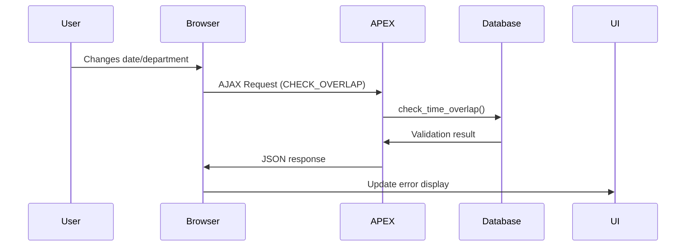

# Example: Contract Validation (Time Overlap / Duplicate) in Oracle APEX

## 1. Database Function (Core Validation)

```sql
/**
* Checks for overlapping time periods between contracts
* @param p_kind_id - Child ID
* @param p_bereich_id - Department ID
* @param p_start_date - New contract start date
* @param p_end_date - New contract end date (NULL = open-ended)
* @param p_bereich_name (OUT) - Returns department name for error messages
* @return BOOLEAN - TRUE if overlap exists
*/
CREATE OR REPLACE FUNCTION check_time_overlap(
    p_kind_id IN NUMBER,
    p_bereich_id IN NUMBER,
    p_start_date IN DATE,
    p_end_date IN DATE,
    p_bereich_name OUT VARCHAR2
) RETURN BOOLEAN IS
    l_overlap_count NUMBER;
BEGIN
    -- Checks for contracts where:
    -- New start <= Existing end AND New end >= Existing start
    -- NULL end dates treated as "infinity" (31.12.9999)
    SELECT COUNT(*), MAX(b.NAME)
    INTO l_overlap_count, p_bereich_name
    FROM SDV_BETREUUNGSVERTRAEGE v
    JOIN SDV_BETREUUNGSBEREICHE b ON v.BETREUUNGSBEREICH_ID = b.BETREUUNGSBEREICH_ID
    WHERE v.KIND_ID = p_kind_id
    AND v.BETREUUNGSBEREICH_ID = p_bereich_id
    AND (
        p_start_date <= NVL(v.END_DATUM, TO_DATE('31.12.9999', 'DD.MM.YYYY'))
        AND NVL(p_end_date, TO_DATE('31.12.9999', 'DD.MM.YYYY')) >= v.START_DATUM
    );
    
    RETURN l_overlap_count > 0;
EXCEPTION
    WHEN NO_DATA_FOUND THEN
        RETURN FALSE;
END;
/
```

## 2. Real-Time Validation (AJAX)

### JavaScript (Client-Side)
```javascript
// Form field event listeners
$(document).on("change", "#P7_BETREUUNGSBEREICH_ID, #P7_START_DATUM, #P7_END_DATUM", function() {
    
    // Values with fallback for empty dates
    const startDate = $("#P7_START_DATUM").val() || '9999-12-31';
    const endDate = $("#P7_END_DATUM").val() || '9999-12-31';
    
    // Call server-side validation
    apex.server.process("CHECK_OVERLAP", {
        x01: $("#P7_KIND_ID").val(),        // Child ID
        x02: $("#P7_BETREUUNGSBEREICH_ID").val(), // Department ID
        x03: startDate,                     // Formatted start date
        x04: endDate                        // Formatted end date
    }, {
        success: function(response) {
            if (response.overlap) {
                // Show error message and highlight fields
                apex.message.showErrors({
                    type: "error",
                    location: "inline",
                    message: response.message,
                    unsafe: false
                });
                $("#P7_START_DATUM, #P7_END_DATUM")
                    .addClass("apex-page-item-error")
                    .attr("title", "Time period overlap detected");
            } else {
                // Clear error styling
                $("#P7_START_DATUM, #P7_END_DATUM")
                    .removeClass("apex-page-item-error")
                    .removeAttr("title");
            }
        },
        dataType: "json",
        error: function(xhr, status, error) {
            console.error("AJAX Error:", status, error);
        }
    });
});
```

### AJAX Callback (Server-Side)
```sql
BEGIN
    DECLARE
        v_department_name VARCHAR2(255);
    BEGIN
        -- Convert parameters and check overlap
        IF check_time_overlap(
            apex_application.g_x01,         -- Child ID
            apex_application.g_x02,         -- Department ID  
            TO_DATE(apex_application.g_x03, 'YYYY-MM-DD'),  -- Start date
            TO_DATE(apex_application.g_x04, 'YYYY-MM-DD'),  -- End date
            v_department_name
        ) THEN
            -- Return JSON response if overlap found
            htp.prn('{
                "overlap": true,
                "message": "Overlap with existing contract in ' || v_department_name || '"
            }');
        ELSE
            -- Return success if no overlap
            htp.prn('{"overlap": false}');
        END IF;
    END;
END;
```

## 3. Server-Side Validation (Before Submit)
```sql
BEGIN
    -- Only validate new contracts (where ID is null)
    IF :P7_BETREUUNGSVERTRAG_ID IS NULL THEN
        DECLARE
            v_department_name VARCHAR2(255);
            v_has_overlap BOOLEAN;
        BEGIN
            -- Perform final validation
            v_has_overlap := check_time_overlap(
                :P7_KIND_ID,               -- Bind variable
                :P7_BETREUUNGSBEREICH_ID,  -- Bind variable
                :P7_START_DATUM,           -- Bind variable
                :P7_END_DATUM,             -- Bind variable
                v_department_name
            );
            
            IF v_has_overlap THEN
                -- Raise APEX error
                apex_error.add_error(
                    p_message => 'Time conflict with contract in ' || v_department_name,
                    p_display_location => apex_error.c_inline_in_notification,
                    p_page_item_name => 'P7_START_DATUM,P7_END_DATUM',
                    p_additional_text => 'Please adjust dates or edit existing contract'
                );
            END IF;
        END;
    END IF;
END;
```

## 4. UI Configuration

### Page Items
| Item | Type | Purpose |
|------|------|---------|
| P7_KIND_ID | Hidden | Stores child ID |
| P7_BETREUUNGSBEREICH_ID | Select List | Department selection |
| P7_START_DATUM | Date Picker | Contract start date |
| P7_END_DATUM | Date Picker | Contract end date (optional) |

### Buttons
```javascript
// Dynamic button handling
function toggleButtons(showOverlap) {
    if (showOverlap) {
        $("#EDIT_EXISTING").show().prop("disabled", false);
        $("#SUBMIT_BUTTON").hide();
    } else {
        $("#EDIT_EXISTING").hide();
        $("#SUBMIT_BUTTON").show().prop("disabled", false);
    }
}
```

## Implementation Notes

1. **Execution Flow**:


2. **Error Handling**:
   - Client-side: Visual feedback with jQuery
   - Server-side: APEX error collection

3. **Test Cases**:
   ```markdown
   - [x] New contract with overlapping dates
   - [x] Open-ended (NULL end date) contracts
   - [x] Edge cases (same start/end dates)
   - [x] Multiple concurrent validations
   ```

4. **Performance Tips**:
   - Create index on `(KIND_ID, BETREUUNGSBEREICH_ID, START_DATUM, END_DATUM)`
   - Consider materialized views for frequent queries
